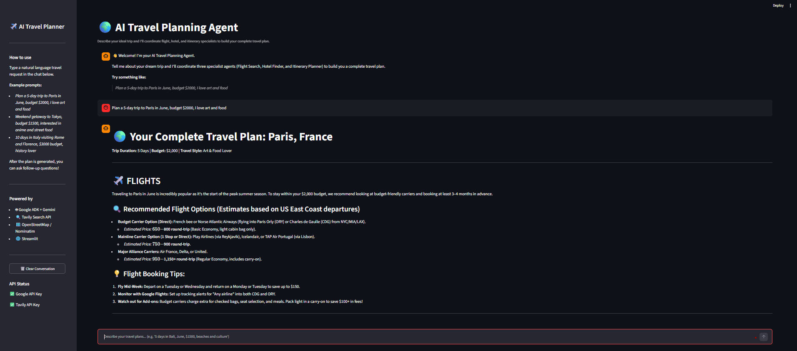

# ✈️ AI Travel Planning Agent

> I built this to see what happens when you let multiple AI agents collaborate on something people actually need — planning a trip. Instead of one giant prompt trying to do everything, a coordinator agent delegates to three specialists, and the result is a complete travel plan with flights, hotels, and a day-by-day itinerary.



---

## What's This Project About?

Travel planning is one of those tasks that looks simple but is actually made up of a bunch of different research problems: finding flights, comparing hotels, mapping out daily activities, estimating costs, figuring out logistics. Asking a single LLM prompt to handle all of that at once usually produces something shallow.

So I tried a different approach: **a team of AI agents, each focused on one thing.**

- **Flight Agent** — researches routes, airlines, price ranges, layover options, and booking tips.
- **Hotel Agent** — compares accommodations across budgets, recommends neighborhoods, and estimates nightly rates.
- **Itinerary Agent** — builds a realistic day-by-day schedule with attractions, meals, transport, and costs.
- **Root Agent** — the coordinator. It reads your request, delegates to the three specialists, and combines everything into one clean travel plan.

I wrapped it all in a Streamlit chat interface so you can just type what you want — like talking to a travel agent — and ask follow-up questions about the plan it generates.

---

## How It Works

You type something like:

> Plan a 5-day trip to Paris in June, budget $2000, I love art and food.

The app sends that to the root agent. It picks out the key details (destination, dates, budget, interests) and calls each specialist. A minute or so later, you get back:

1. ✈️ **Flight options** with airlines, prices, and booking advice
2. 🏨 **Hotel picks** across budget, mid-range, and luxury tiers
3. 📅 **A day-by-day itinerary** with activities, restaurants, and transport tips
4. 💰 **A budget summary** pulling it all together
5. 💡 **Practical tips** specific to your destination

After the plan is generated, you can keep chatting:

> "Can you swap the Day 3 museum visit for something outdoors?"

The agent remembers the full plan and adjusts accordingly.

---

## Features

- 💬 Natural-language travel planning through a chat interface
- 🤖 A coordinator agent backed by three focused specialist agents
- 🔍 Real-time web research via the Tavily Search API
- 🗺️ Geographic lookups through OpenStreetMap / Nominatim
- 📋 Flights, hotels, itinerary, and budget — all in one response
- 🔄 Follow-up questions within the same conversation
- 🗑️ One-click conversation reset
- ✅ API key status indicators in the sidebar
- 🔁 Automatic retry for temporary model overload and quota errors
- 🩹 Session recovery when the in-memory store gets cleared

---

## Architecture

Here's the high-level flow:

```text
User
  │
  ▼
Streamlit Chat UI
  │
  ▼
Root Agent (coordinator)
  │
  ├──▶ Flight Agent ──────▶ Tavily web search
  │
  ├──▶ Hotel Agent ───────▶ Tavily web search
  │
  └──▶ Itinerary Agent ──▶ Tavily web search
                            OpenStreetMap / Nominatim
  │
  ▼
Complete Travel Plan
```

### How the agents work together

The **root agent** doesn't do any research itself. It reads your request, figures out what needs to happen, and calls the three specialists using Google ADK's `AgentTool`. Each specialist has a focused prompt that keeps it in its lane — the flight agent doesn't try to recommend restaurants, and the itinerary agent doesn't price out hotels.

Once all three come back with their findings, the root agent stitches everything together into a single, well-formatted Markdown response.

---

## Tech Stack

| What | Technology |
|------|-----------|
| Agent framework | [Google ADK](https://github.com/google/adk-python) (`google-adk`) |
| Language model | Gemini 3.5 Flash |
| Web search | [Tavily](https://tavily.com/) Search API |
| Geocoding | [geopy](https://geopy.readthedocs.io/) + OpenStreetMap / Nominatim |
| Front-end | [Streamlit](https://streamlit.io/) |
| Config | python-dotenv |
| Async support | asyncio + nest-asyncio |

---

## Project Structure

```text
ai_travel_planning_agent/
├── app.py              ← Streamlit UI, session management, error handling
├── agents.py           ← All four agents and their prompts
├── tools.py            ← Tavily search + geographic lookup functions
├── requirements.txt    ← Python dependencies (with pinned async stack)
├── .env.example        ← API key template (safe to commit)
├── .gitignore          ← Keeps secrets and local files out of Git
└── assets/
    └── demo.png        ← Screenshot for the README
```

### Quick tour of the code

**`app.py`** — The entry point. Sets up Streamlit, creates the ADK runner, manages chat history and sessions, handles retries for flaky API responses, and renders the UI.

**`agents.py`** — Defines the four agents with their prompts. The prompts are written in a conversational tone (like you're briefing a colleague), which tends to produce better, more natural output from the model.

**`tools.py`** — Two tool functions the agents can call:
- `tavily_search()` — searches the web for current travel info
- `find_nearby_places()` — looks up coordinates and address details via OpenStreetMap

---

## Prerequisites

Before you run anything, you'll need:

- **Python 3.10+** installed
- A **Google AI Studio API key** — [get one here](https://aistudio.google.com/app/apikey) (free)
- A **Tavily API key** — [sign up here](https://app.tavily.com) (free tier available)

---

## Setup

### 1. Clone the repo

```bash
git clone https://github.com/YOUR_USERNAME/ai-travel-planning-agent.git
cd ai-travel-planning-agent
```

### 2. Create a virtual environment

**Windows (PowerShell):**
```powershell
python -m venv .venv
.\.venv\Scripts\Activate.ps1
```

**macOS / Linux:**
```bash
python3 -m venv .venv
source .venv/bin/activate
```

### 3. Install dependencies

```bash
pip install -r requirements.txt
```

### 4. Set up your API keys

Copy the example env file and add your keys:

**Windows:**
```powershell
Copy-Item .env.example .env
```

**macOS / Linux:**
```bash
cp .env.example .env
```

Then open `.env` and replace the placeholders:

```env
GOOGLE_API_KEY=your_actual_google_key
TAVILY_API_KEY=your_actual_tavily_key
```

> ⚠️ **Important:** These are *your* personal API keys. Every user needs their own. Never commit your `.env` file or paste real keys into `.env.example`.

### 5. Run the app

```bash
streamlit run app.py
```

Open the URL shown in the terminal (usually `http://localhost:8501`).

The sidebar will show green checkmarks next to each API key if everything is configured correctly. If you see a red ❌, double-check that:
1. Your file is named `.env` (not `.env.txt` or `.env.example`)
2. It's in the project root directory
3. The variable names are exactly `GOOGLE_API_KEY` and `TAVILY_API_KEY`
4. There are no extra quotes or spaces around the key values
5. You restarted Streamlit after editing the file

> 💡 **PowerShell tip:** If script execution is blocked, you can bypass the activation step and run directly with:
> ```powershell
> .\.venv\Scripts\python.exe -m streamlit run app.py
> ```

---

## Example Prompts

Try these to see what the agent can do:

```
Plan a 5-day trip to Paris in June, budget $2000, I love art and food.
```

```
Weekend in Tokyo for $1500 — I'm into anime, street food, and exploring by train.
```

```
10 days in Italy (Rome + Florence), $3000 budget, history and local food lover.
```

```
Can you make the itinerary cheaper and swap the expensive hotel for something mid-range?
```

---

## Dependency Compatibility Note

You'll notice that `starlette` and `anyio` are pinned to specific versions in `requirements.txt`:

```text
starlette==1.7.0
anyio==4.9.0
```

I pinned these because newer combinations of Streamlit, Starlette, AnyIO, and Python 3.14 caused HTTP 500 errors when serving static files (`AsyncLibraryNotFoundError` / `NoEventLoopError` inside the server stack). The travel agent code itself wasn't the problem — it was a compatibility issue in the async server layer.

These pinned versions work reliably together. If you update other dependencies, keep an eye on these two.

---

## Error Handling

The app handles several common failure modes so you don't have to:

- **503 / UNAVAILABLE** (model overloaded) → automatic retry with exponential backoff
- **429 / RESOURCE_EXHAUSTED** (quota hit) → one retry after a longer pause
- **Lost sessions** → automatically recreated
- **Tavily / Nominatim down** → clear error message instead of a crash
- **UI feedback** → temporary errors are shown as friendly messages, not stack traces

---

## Limitations

This is a **planning assistant and AI engineering demo**, not a booking platform.

- Prices and availability are estimates based on web searches — they change constantly
- The app doesn't book anything (no tickets purchased, no rooms reserved)
- Always verify entry requirements through official government sources
- Conversations are stored in memory only — they're lost if Streamlit restarts
- Responses can take 30–60 seconds because multiple web searches run behind the scenes
- Please respect [OpenStreetMap's usage policy](https://operations.osmfoundation.org/policies/nominatim/) for geocoding requests

---

## Testing Without API Calls

You can verify everything is wired up correctly without making any live API calls:

```bash
# Check that the Python files compile without errors
python -m py_compile app.py agents.py tools.py

# Check that all dependencies are installed and compatible
pip check

# Start the app in headless mode to verify it loads
streamlit run app.py --server.headless true
```

---

## Pushing to GitHub

This folder is ready to be its own repository. From the project directory:

```bash
git init
git add .
git commit -m "Initial commit — AI Travel Planning Agent"
git branch -M main
git remote add origin https://github.com/YOUR_USERNAME/ai-travel-planning-agent.git
git push -u origin main
```

**Before you push, double-check:**
- [ ] `.env` is **not** tracked (run `git status` to confirm)
- [ ] No API keys appear anywhere in the source code
- [ ] `.venv/` is **not** being uploaded
- [ ] `requirements.txt` and `.env.example` are included
- [ ] `assets/demo.png` is included if you want the screenshot to show up

---

## Ideas for Future Improvements

Some things I'd like to add down the road:

- 💾 Persistent conversation storage (database instead of in-memory)
- 📊 Structured JSON responses between agents for cleaner data flow
- ✅ Better price validation against live booking APIs
- 🗺️ A real nearby-places search using Overpass / OSM POI queries
- 🧭 Interactive map view of the itinerary
- 🎛️ UI controls for travel style, budget sliders, and preference toggles
- ⚡ Search result caching to cut down on API calls and speed things up
- 🧪 Automated tests for the search and geocoding tools

---

## Author's Note

This project is part of my hands-on exploration of AI agents and tool-using language models. The core idea I wanted to demonstrate is that **a complex task becomes much easier to build (and maintain) when you break it into specialized responsibilities and coordinate them through a root agent**.

The code is intentionally straightforward — easy to read, easy to modify, easy to extend. If you're experimenting with multi-agent workflows, external tool integration, async execution, or building AI apps with Streamlit, I hope this gives you a useful starting point.

---

## License

This project is open source. Feel free to use, modify, and build on it.
